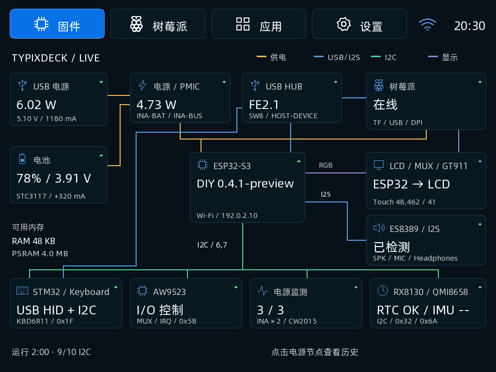
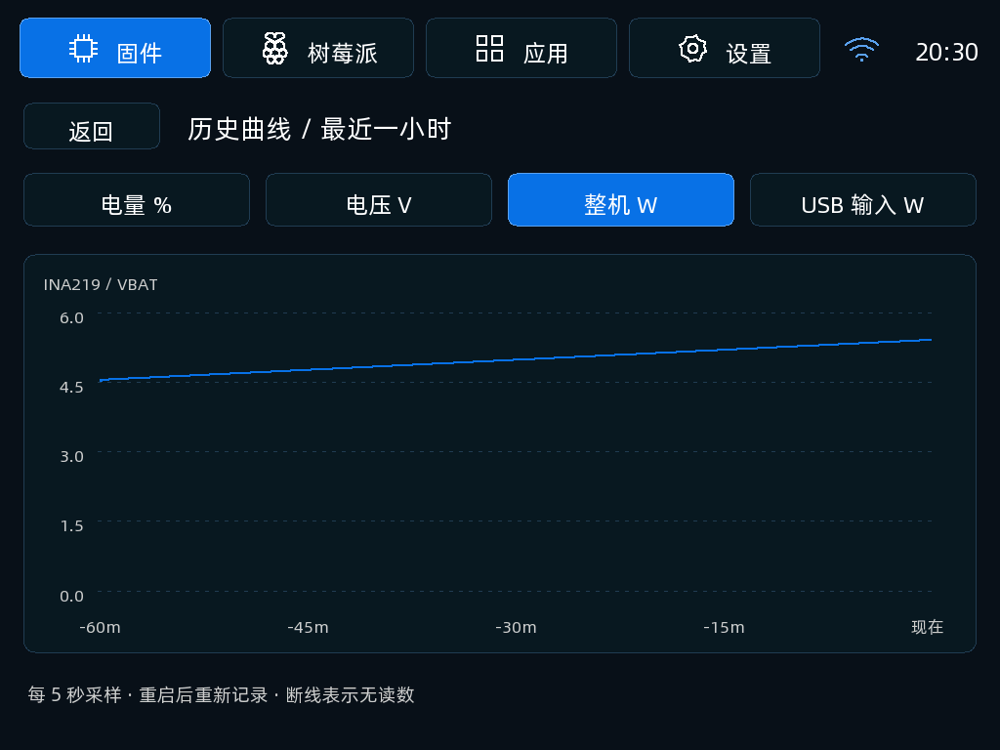
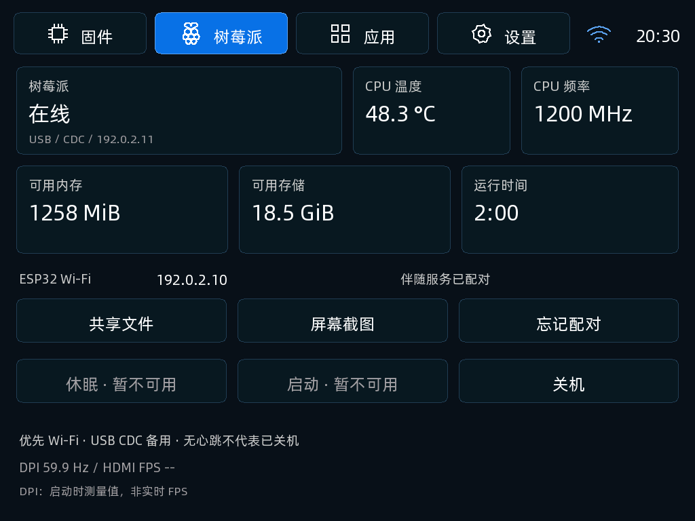
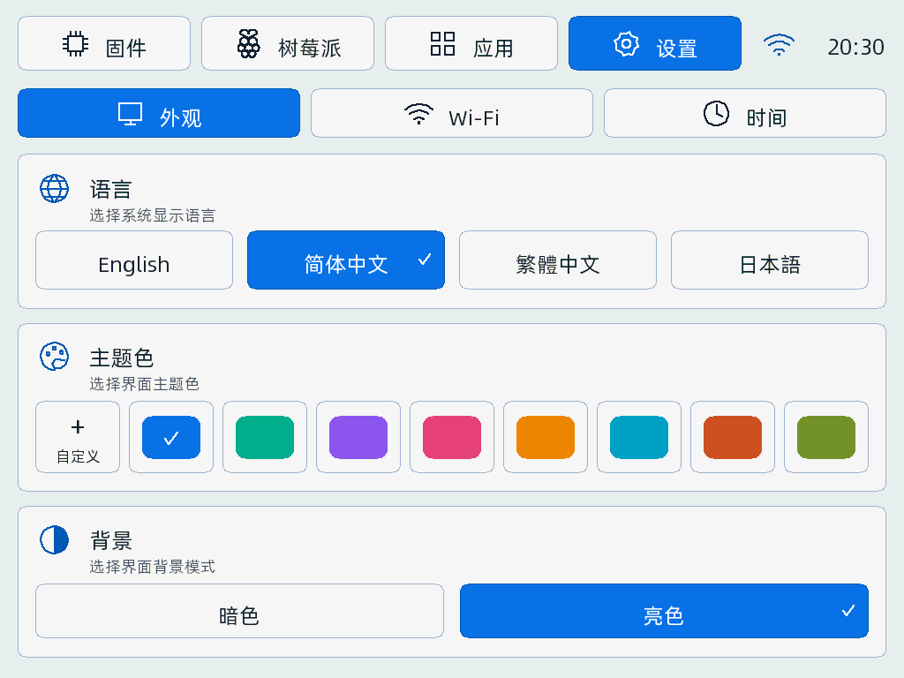

# TypixDeck DIY ESP32-S3 Firmware

面向 TypixDeck 板载 ESP32-S3 协处理器的独立界面与应用，基于官方固件 `fde9dac` 改造。最新版本 **0.4.1 预发布版**，提供源码、应用镜像、完整镜像及 SHA256 清单，并收录到 [Copilot 在线固件目录](https://github.com/typixdeck/copilot/tree/main/firmware/typixdeck-diy/0.4.1)。

[下载 0.4.1](https://github.com/typixdeck/diy-esp32s3-firmware/releases/tag/v0.4.1) · [发布说明与验收范围](docs/releases/0.4.1.md)

## 0.4.1 修正与诊断

- 小乐器启用时将 ES8389 设为单位增益，去掉与软件音量叠加的固定衰减；保留混音余量，退出后恢复 USB 音量和静音状态。
- Pi 文件/截图请求复用 HTTPS 连接，增加连接、响应及取消的有界处理；旧连接失效时仅重试一次。
- 主题色同时应用于背景、卡片和边框，暗色界面的文字保持白色/灰色。
- 新增只读 `TD_BATT v2` 诊断，便于核对电量计原始寄存器和 RAM 校验；**电量显示 0% 的问题尚未修复**。

0.4.1 已通过本地行为测试和 ESP-IDF 构建，尚未刷入真机，`hardware_verified=false`。此前 0.4.0 通过应用区写入、完整读回与短时启动检查，但仍收到共享功能、低音量和电量异常反馈；不能将该结果当作 0.4.1 的硬件验收。Copilot 的完整备份/写入/回读流程也仍待验收。

## 0.4.0 固件拓扑与 Pi 共享

- 首页“固件”以可点击连接拓扑替代指标面板，组件上显示实际读数；供电节点可查看电量、电压、整机功耗、USB 输入功率的最近一小时曲线。
- 树莓派页新增 IP、内存、存储和运行状态。配对 HTTPS 优先，离线时串口遥测备用；文件和屏幕截图通过只读伴随服务获取，当前需要 Wi-Fi。
- 虚拟字符键盘已移除；实体键盘 Shift/Sym、退格、Enter、Fn+Tab 输入可用，触摸确认/取消保留。
- 修正 GT911 无新报告时误判松手及错误应答；MIDI 音符变化只重绘琴键，取消弹奏时每 500 ms 整页重绘。实际响应延迟仍待测量。
- CM4 的 GT911 开机无应答问题提供有界驱动重探测服务，不改供电、MUX 或复位引脚。
- 共享文件最大 256 KiB，缓存仅在 PSRAM；不执行第三方代码，不声称已有动态应用安装器。TLS 缓冲使用 PSRAM，不改 Flash 分区或板级供电/MUX 初始化。

[设计与动态应用规划](docs/hmi-and-apps.md) · [Pi 服务安装与配对](host/README.md)

## 0.3.2 Wi-Fi 内存配置

0.3.1 真机可启动，但用户开启 Wi-Fi 后报告初始化失败，内部空闲内存仅约 13 KB。0.3.2 让普通较大分配及 Wi-Fi/lwIP 优先使用 PSRAM，关闭两项 Wi-Fi IRAM 吞吐优化，并限制收发缓冲数量；LCD/I2S DMA、任务栈与内部保留池不变。实测关闭 Wi-Fi 时内部空闲约 87 KB，开启并扫描后约 55 KB，扫描返回 5 个网络且错误码为 0。完整的账号连接、对时、重启自动重连仍需分别验收。

新增 `WIFI_STATUS` 固定字段诊断（不输出 SSID、IP、MAC、密码）及本地 USB 维护命令 `WIFI_ON`、`WIFI_OFF`、`WIFI_SCAN`；与触摸界面共用异步服务。界面在初始化失败时显示实际 SDK 错误码，内存不足显示具体原因。

## 0.3.1 启动容错与诊断

- I2S/ES8389 初始化失败时释放已申请资源、保留空音频句柄，继续尝试 USB UAC/CDC；去掉可选音频初始化中的强制 abort。音频句柄仅在完整初始化成功后发布。
- Wi-Fi 关闭时不初始化无线驱动；用户开启或此前保存为开启时才初始化。初始化失败不重复创建网络接口，仍可关闭 Wi-Fi、修改时间设置。
- CDC 连接后或收到精确命令 `BOOT_STATUS` 时输出一行 `TD_DIAG`：固件版本、复位原因、上一轮/当前启动阶段、音频/USB 错误码和内部可用内存。RTC 阶段记录仅对校验通过的暖复位有效，冷启动、掉电或记录损坏不沿用。没有写 Flash 日志、保存完整串口流或内存转储。
- 这些改动修复了源码中确认存在的容错缺陷，**并未证明这次真机循环启动的根因**。构建与故障注入通过不等于硬件修复成功，该版本的记录不代表后续候选已通过硬件验收。

诊断限制、阶段编号与验收步骤见 [启动故障记录](docs/boot-diagnostics.md)。

## 0.3.0 界面

按传感器、设置和小乐器参考图重新布局，使用原生线条图标、紧凑顶栏、四个指标卡及清晰的黑白琴键。树莓派、应用列表和时钟沿用同一视觉风格。

- 传感器检测数量根据实际结果计算；电量曲线固定最近一小时，较短历史只绘制对应时间段。
- 外观设置提供八个预设色和自定义 RGB 调色，可应用或取消，并保存到 NVS；任意主题色自动选择清晰的前景文字。
- 亮暗选项与实际背景一致；顶栏时间及 Wi-Fi 图标来自当前状态。
- 钢琴采用七白五黑叠放布局，优先命中黑键，显示实体键及触摸持有反馈。

## 四个 Tab

| 页面 | 功能 |
| --- | --- |
| 固件 | 连接拓扑、组件读数、接口详情、四种历史曲线、RAM/PSRAM 状态 |
| 树莓派 | 在线状态、IP、CPU、可用内存/存储、运行时间、配对只读文件/截图、串口协作关机 |
| 应用 | MIDI 小乐器、时钟，运行在 ESP32 上 |
| 设置 | Wi-Fi 扫描/连接/忘记网络、NTP 服务器/立即对时/时区、语言、八色主题色盘、自定义 RGB 颜色、亮/暗背景 |

旧的四套 Theme 已移除。外观偏好保存在 NVS；旧 `theme` 键忽略，语言与预设色编号保留。保存失败在界面提示，不自动擦除 NVS。字体子集缺少翻译字形时回退到可显示的简体或英文，避免空白方框。

下图由**实际固件绘图代码**在电脑上生成，使用明确的测试数据，**不是真机截图**。







[树莓派](docs/screenshots/pi-dark.png) · [应用](docs/screenshots/apps-dark.png) · [时钟](docs/screenshots/clock-dark.png) · [Wi-Fi](docs/screenshots/wifi-light.png) · [时间](docs/screenshots/time-light.png)

[暗色设置](docs/screenshots/settings-dark.png) · [自定义 RGB](docs/screenshots/settings-custom-dark.png) · [按住琴键](docs/screenshots/instrument-held-dark.png)

## 操作

- 顶部四页支持触摸切换；键盘 Tab/方向键移动焦点，Enter 激活，Fn+Tab 返回。
- 方形键继续切换 Pi/ESP 显示。开机 5 秒没有检测到 Pi 显示信号，进入 ESP 页面；不改变 CM 电源使能。
- 插拔耳机仅在当前 ESP 页面提示，不再抢屏。
- Wi-Fi 密码使用实体键盘输入，Shift/Sym 对应大小写和符号层；Enter 确认、Fn+Tab 取消，屏幕不再显示虚拟字符键盘。

## MIDI 小乐器

本地八复音合成器，48 kHz / 16 bit / 双声道，经板载 ES8389 输出到扬声器或耳机。四种音色：正弦、三角、方波、拨弦。

- `A S D F G H J K L`：自然音；`Q W E R T Y U`：半音。
- 左右键切八度，上下键切音色，音量键调音量；Enter 停止所有音符。
- 可触摸屏幕上的十二个琴键，支持滑动换音；同音的实体键和触摸键独立释放。
- 离开应用、切换显示、键盘掉线或输入溢出均停止声音；返回后若音源停用，点击“启用音源”。
- 本地播放与 USB 播放共用互斥门控；本地音源启用时丢弃主机播放数据，退出恢复主机音量/静音设置。

这里的 MIDI 指音符模型和弹奏功能，**尚未提供 USB/BLE MIDI 对外协议、标准 GM 音色库或 MIDI 文件播放器**。音频故障恢复、实际延迟及无 Pi 时的键盘扫描仍需真机验证。

## Wi-Fi 与时钟

Wi-Fi 首次默认关闭，不内置私人网络。支持开放网络及 WPA Personal，不包含企业网络配置。扫描、连接、取消、断开、对时在后台执行；连接最多重试两次，扫描/连接/NTP 都有超时。

凭据仅在成功取得对应网络 IP 后写入设备 NVS；密码不显示、不写日志，取消输入和连接临时缓冲区会清理。NVS 并未因此获得 Flash 加密，不能宣称凭据静态加密。全镜像重刷会覆盖这些数据。

NTP 默认 `pool.ntp.org`，可修改。时区为 UTC 偏移，支持半小时步进，不自动处理夏令时。首次未同步显示 `--:--:--`；同步后断网可以继续计时。当前时钟未接入板载 RX8130 的读写与断电保持，冷启动后需要重新对时。

## 树莓派控制的实际边界

- **协作关机已实现协议与主机服务**：需要 Pi 安装并显式启用 [host/companion.py](host/README.md)，且当前用户已有 Linux 免交互关机授权。屏幕上需要确认后才发送请求。
- `已受理` 仅表示系统接受关机请求，不代表存储卸载或 CM 已掉电；超时、USB 消失都不作为安全断电证据，不自动重试。
- **深度休眠、硬件启动暂不可用**，页面明确禁用。没有新增 AW9523/GLOBAL_EN/GPIO 操作；需另行完成板级供电、关机握手及恢复验证，不能假装已实现。
- 内屏 DPI 数值是启动时最后测量值，绝非 HDMI 或实时 FPS。HDMI 未提供真实采样时显示 `--`；主机协作服务不将显示模式刷新率冒充实测 FPS。
- 遥测超时显示未知/离线，不推断物理电源状态。

原 LCD、触摸、USB UAC、I²C 和电源初始化策略继续复用；本轮不改变 AW 初始化方向、复位或刷写流程。0.3.2 外部 USB 启动验证已通过；0.4.0 已通过 CM4 侧 app-only 写入、完整读回与运行诊断。首次联网和交互的待验收项见 [HMI 验证记录](docs/hmi-and-apps.md)。

## 构建与本地验证

目标 `esp32s3`，8 MB Flash + 8 MB PSRAM；当前编译验证使用 **ESP-IDF 5.5.1**，依赖记录在 `dependencies.lock`。先激活对应 ESP-IDF 环境，再运行：

```sh
python tools/build.py
python tools/package.py
```

`build.py` 先保留仓库的三个 ES8389 补丁文件，解析完整依赖，再恢复补丁并构建，避免新克隆中的残缺 managed component 目录阻止构建。两个脚本均不连接串口、不刷写。

产物在 `build/package/`：

- `typixdeck-diy-0.4.1-app.bin`：应用镜像，仅在分区、字体布局兼容时适用。
- `typixdeck-diy-0.4.1-full.bin`：Bootloader、分区表、应用、字体；完整写入会覆盖 NVS。
- `manifest.json`：地址、大小、SHA256、未完成硬件验收标识。

主机行为测试需 C 编译器、Python 3、pkg-config 和 FreeType：

```sh
python3 tools/check.py
```

覆盖音频初始化 13 个失败点的资源回收、RTC 暖复位/损坏记录/输出边界、Wi-Fi 延迟初始化与初始化失败、网络失败/取消/存储失败、合成器音高/复音/释放、Pi 协议会话/重放/超时、主机授权，以及实际 UI/TTF 绘图的按钮边界、黑白琴键命中和持有、自定义颜色应用/取消/保存、输入、音符释放和密码遮蔽。C 检查启用 ASan/UBSan。

仅生成预览：`python3 tools/preview_ui.py`，输出 `build/preview-ui/`。测试数据只在 `tools/`、`tests/` 中，不参与设备固件编译。

## 目录与许可

`main/` 为设备代码，`host/` 为 Pi 协作服务，`tools/` 为本地构建/验证工具，`tests/` 为行为测试，`docs/screenshots/` 为预览图。`release/` 保留上游历史镜像，不代表新的 DIY 版本。

MIT，见 [LICENSE](LICENSE)；组件和字体保留各自许可。硬件依据：[TypixDeck schematics](https://github.com/TypixNode/TypixDeck-schematics)。
